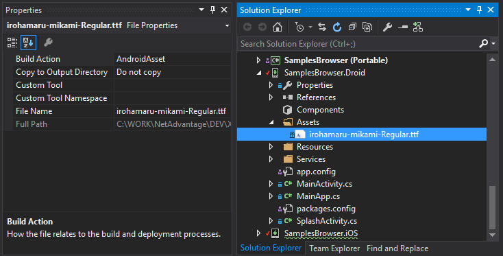
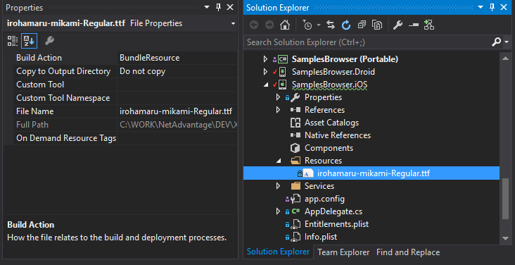

= Override Default Font With Custom Font

=== Purpose
This topic provides instructions how to override default font on all components of {ProductName} product with a custom font, for example to display Japanese symbols in axis labels or titles of {DataChartName} control.

=== In this topic

This topic contains the following sections:
 
* <<AddingFontAndroid,Adding custom font to Android Project>> 
* <<AOverridingFontAndroid,Overriding default font in Android Project>> 
* <<AddingFontIOS,Adding custom font to iOS Project>> 
* <<OverridingFontIOS,Overriding default font in iOS Project>>  
* <<RelatedContent,Related Content>>

[[AddingFontAndroid]]
== Adding custom font to Android Project
 
In *.Droid* project, add custom font .ttf file under *Assets* folder. Then set *BuildAction* to *AndroidAsset* in properties of the font file. The following figure shows how to configure *.Droid* project for custom Japanese font  

[[AOverridingFontAndroid]]
== Overriding default font in Android Project

Open *MainActivity.cs* file and add the following code to the OnCreate method:

*In C#:*

[source,cs]
----
// loading Japanese font from Assets folder
var fontName = "irohamaru-mikami-Regular.ttf";
var fontPath = System.IO.Path.Combine(CacheDir.AbsolutePath, fontName);
using (var asset = Assets.Open(fontName))
{
    using (var dest = System.IO.File.Open(fontPath, System.IO.FileMode.Create))
    {
        asset.CopyTo(dest);
    }
}

// overriding default font with custom font that supports Japanese symbols
var font = SkiaSharp.SKTypeface.FromFile(fontPath);
Infragistics.Core.Controls.TypefaceManager.Instance.OverrideDefaultTypeface(font); 
----

[[AddingFontIOS]]
== Adding custom font to iOS Project
 
In *.iOS* project, add custom font .ttf file under *Resources* folder. Then set *BuildAction* to *BundleResource* in properties of the font file. The following figure shows how to configure *.iOS* project for custom Japanese font  

[[OverridingFontIOS]]
== Overriding default font in iOS Project

Open *AppDelegate.cs* file and add the following code to the FinishedLaunching method:

 
*In C#:*

[source,cs]
----
// loading Japanese font from Resources folder
var fontName = "irohamaru-mikami-Regular.ttf";
var fontPath = NSBundle.MainBundle.PathForResource(
    System.IO.Path.GetFileNameWithoutExtension(fontName),
    System.IO.Path.GetExtension(fontName));
    
// overriding default font with custom font that supports Japanese symbols
var font = SkiaSharp.SKTypeface.FromFile(fontPath);
Infragistics.Core.Controls.TypefaceManager.Instance.OverrideDefaultTypeface(font);

----
 
[[RelatedContent]]
=== Related Content

The following topics provide additional information related to this topic:

[options="header", cols="a,a"]
|====
|Topic|Purpose

| link:categorychart-chart-title-subtitle.html[Chart Title and Subtitle]
|This topic describes how to set title and subtitle of {CategoryChartName} control.

| link:categorychart-configuring-axis-titles.html[Chart Axis Titles]
|This topic describes how to set axis title of {CategoryChartName} control.

| link:datachart-chart-title-and-subtitle.html[Configuring Chart Title]
|This topic describes how to configure title and subtitle of {DataChartName} control.

| link:datachart-axis-title.html[Configuring Axis Title]
|This topic describes how to configure axis title of {DataChartName} control.

|====